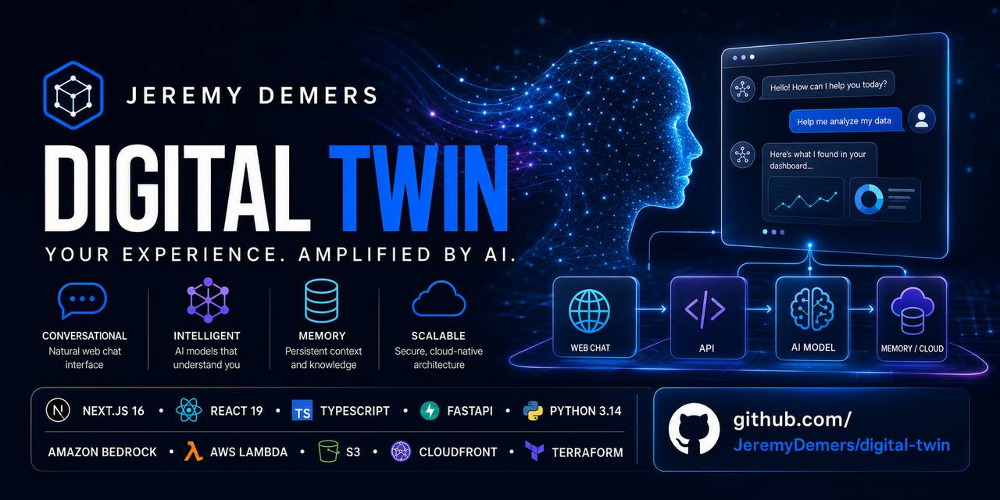
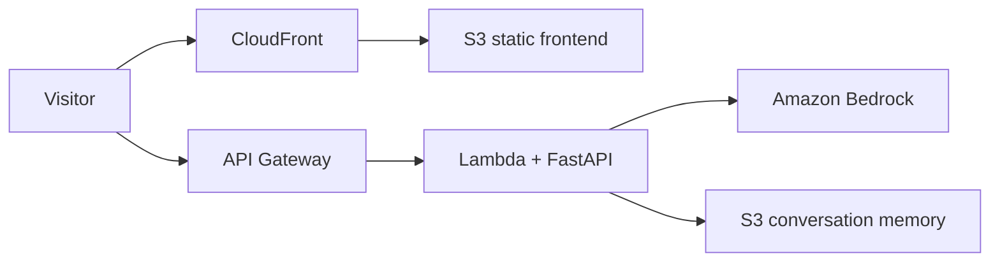

# Jeremy Demers' Digital Twin

> A full-stack, cloud-native AI experience that turns professional context, project history, and communication style into a conversational digital twin.

<p align="center">
  
</p>

This project is an interactive digital twin of Jeremy Demers. Visitors can ask about Jeremy's experience, projects, approach to AI, and working style through a responsive chat interface backed by Amazon Bedrock. The application combines a statically exported Next.js frontend with a serverless FastAPI backend and infrastructure managed entirely with Terraform.

## Highlights

- **Context-aware conversation** — grounds responses in curated professional facts, summaries, writing style, and LinkedIn history.
- **Persistent sessions** — keeps conversation history in local JSON files during development and Amazon S3 in AWS.
- **Production-focused interface** — responsive design, dark and light themes, accessible controls, suggested prompts, and Markdown responses.
- **Interactive architecture viewer** — lazy-loads a Mermaid diagram so visitors can inspect the AWS system without increasing the initial bundle.
- **Serverless AWS deployment** — uses Lambda, API Gateway, Bedrock, S3, CloudFront, IAM, and optional Route 53/ACM resources.
- **Infrastructure as code** — provisions repeatable `dev`, `test`, and `prod` environments with Terraform workspaces.

## Tech Stack

| Layer | Technology |
| --- | --- |
| Frontend | Next.js 16, React 19, TypeScript, Tailwind CSS 4 |
| Interface | Lucide React, React Markdown, Remark GFM, Mermaid |
| API | FastAPI, Pydantic, Mangum |
| AI | Amazon Bedrock Converse API, Amazon Nova |
| Runtime | Python 3.14, AWS Lambda |
| Storage | Amazon S3 for conversation memory and static hosting |
| Delivery | API Gateway HTTP API, Amazon CloudFront |
| Infrastructure | Terraform, AWS IAM, optional Route 53 and ACM |

## Architecture



The browser loads the exported Next.js application through CloudFront and sends chat requests directly to API Gateway. Lambda runs the FastAPI application through Mangum, calls Amazon Bedrock for a response, and persists session history in a private S3 bucket. Local development uses filesystem-based memory instead.

See [AWS Deployment Architecture](./backend/terraform/ARCHITECTURE.md) for the complete resource diagram, conditional custom-domain path, IAM relationships, and Terraform state flow.

## Quick Start

### Prerequisites

- Node.js 20 or newer
- Python 3.14
- [uv](https://docs.astral.sh/uv/)
- AWS credentials with access to the configured Amazon Bedrock model

Clone the repository and prepare the environment:

```bash
git clone https://github.com/JeremyDemers/digital-twin.git
cd digital-twin
cp .env.example .env
```

Start the API in one terminal:

```bash
cd backend
uv sync
uv run uvicorn server:app --reload --port 8000
```

Start the frontend in another terminal:

```bash
cd frontend
npm install
npm run dev
```

Open [http://localhost:3000](http://localhost:3000). The frontend uses `http://localhost:8000` as its default API URL.

## Configuration

| Variable | Purpose | Default |
| --- | --- | --- |
| `DEFAULT_AWS_REGION` | AWS region used by the Bedrock client and deployment scripts | `us-east-1` |
| `BEDROCK_MODEL_ID` | Bedrock model used for chat responses | `global.amazon.nova-2-lite-v1:0` locally |
| `NEXT_PUBLIC_API_URL` | Browser-facing FastAPI/API Gateway base URL | `http://localhost:8000` |
| `CORS_ORIGINS` | Comma-separated browser origins allowed by FastAPI | `http://localhost:3000` |
| `USE_S3` | Store conversation memory in S3 instead of local files | `false` |
| `S3_BUCKET` | S3 bucket used when persistent memory is enabled | Empty |
| `MEMORY_DIR` | Local conversation-memory directory | `../memory` |
| `PROJECT_NAME` | Resource naming prefix | `digital-twin` |

Never commit `.env` files, AWS credentials, Terraform state, or conversation memory. The repository's `.gitignore` excludes these paths.

## API

| Method | Endpoint | Description |
| --- | --- | --- |
| `GET` | `/` | Returns service and storage information |
| `GET` | `/health` | Reports API, storage, and model status |
| `POST` | `/chat` | Sends a message and returns the twin's response and session ID |
| `GET` | `/conversation/{session_id}` | Retrieves the stored conversation for a session |

Example chat request:

```bash
curl -X POST http://localhost:8000/chat \
  -H "Content-Type: application/json" \
  -d '{"message":"What kind of AI work have you done?"}'
```

Example response:

```json
{
  "response": "...",
  "session_id": "a generated UUID"
}
```

Pass the returned `session_id` with later messages to continue the same conversation.

## Deploy to AWS

The deployment script packages the Python application for Lambda, applies the Terraform configuration, exports the frontend, syncs it to S3, and reports the resulting CloudFront and API Gateway URLs.

Before deploying, install and authenticate the AWS CLI, install Terraform and Docker, enable access to the selected Bedrock model, and provision the S3 state bucket and DynamoDB lock table referenced by `scripts/deploy.sh`.

Generate the Lambda requirements file from the locked Python project, then deploy:

```bash
cd backend
uv export --no-dev --format requirements-txt --output-file requirements.txt
cd ..
./scripts/deploy.sh prod digital-twin
```

Production settings, including the optional custom domain, live in `backend/terraform/prod.tfvars`. Review the Terraform plan and expected AWS costs before applying infrastructure.

To remove an environment and its stored data:

```bash
./scripts/destroy.sh prod digital-twin
```

## Project Structure

```text
digital-twin/
├── frontend/                   # Next.js interface and static assets
│   ├── app/                    # App Router layout, page, and global styles
│   ├── components/             # Chat, Markdown, and architecture UI
│   └── public/                 # Profile and social preview images
├── backend/                    # FastAPI application and twin context
│   ├── data/                   # Curated facts, summary, style, and profile data
│   └── terraform/              # AWS infrastructure and architecture docs
├── scripts/                    # Deployment and teardown workflows
└── .env.example               # Safe local configuration template
```

## Privacy and Responsible Use

- Chat messages are sent to Amazon Bedrock for inference.
- Local sessions are written beneath `memory/`; deployed sessions are stored in the configured private S3 bucket.
- The system prompt instructs the twin to distinguish itself from the human when asked directly and to avoid inventing details that are not present in its context.
- Treat profile documents and conversation history as personal data. Apply appropriate retention, access-control, and logging policies before a public production deployment.

## Useful Commands

```bash
# Frontend quality checks
cd frontend && npm run lint
cd frontend && npm run build

# Backend development server
cd backend && uv run uvicorn server:app --reload

# Terraform formatting and validation
terraform -chdir=backend/terraform fmt -check
terraform -chdir=backend/terraform validate
```

---

Built as a practical exploration of personalized AI, serverless application design, and production infrastructure on AWS.
