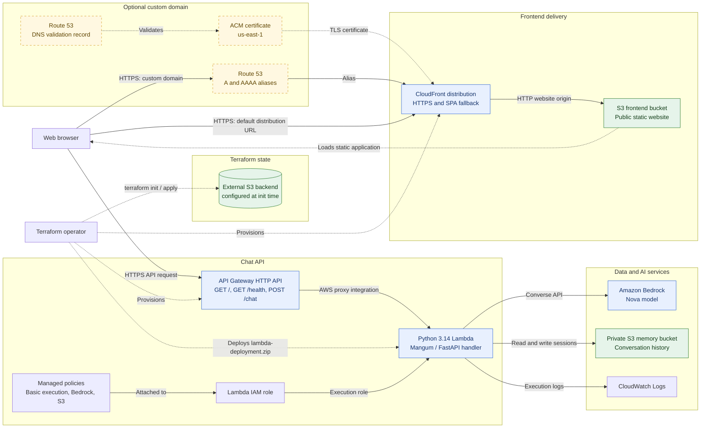

# AWS Deployment Architecture

This diagram reflects the resources and relationships declared in the Terraform configuration in this directory. Dashed elements are conditional or deployment-time dependencies rather than request traffic.

## Architecture notes

- CloudFront serves only the exported frontend from the S3 website endpoint. API requests go from the browser to the separate API Gateway URL.
- The custom domain, Route 53 aliases, and ACM certificate resources are created only when `use_custom_domain` is enabled. Terraform can either create the certificate or use an existing ARN.
- Lambda stores conversation history in the private memory bucket and calls the configured Bedrock model.
- The Lambda role receives AWS-managed permissions for logging, Bedrock, and S3 access.
- The Terraform S3 backend bucket is supplied during `terraform init`; this configuration does not provision that bucket.
